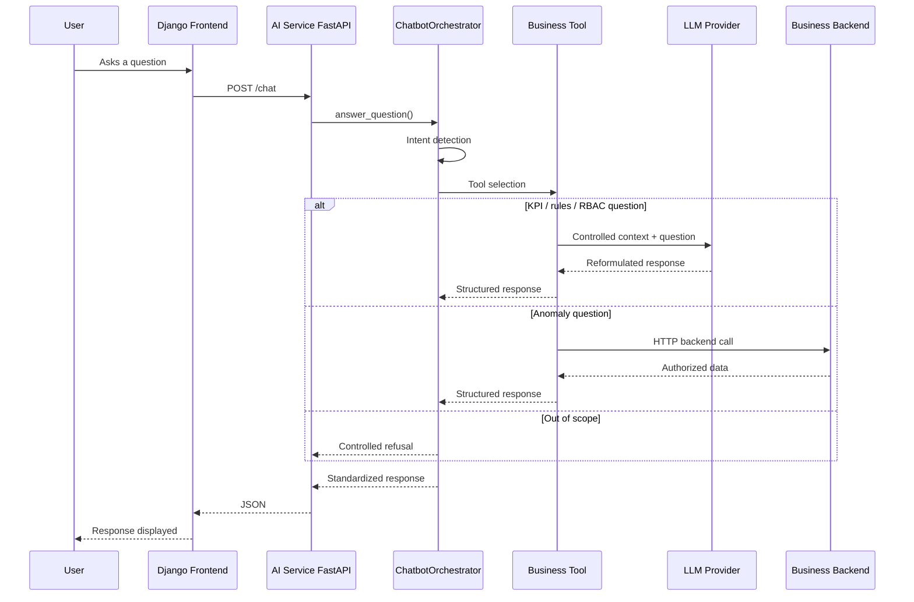

# Functional and Technical Architecture of the AI Chatbot

## 1. Purpose of the AI Component

The AI chatbot of Pricing Control Tower is designed to assist users in understanding data, business rules, and anomalies related to pricing management.

It enables users to:

* explain business KPIs;
* explain pricing business rules;
* explain user roles, permissions, and scopes;
* identify the right business tool based on a user question;
* return a structured response consumable by the frontend;
* trace interactions to prepare for monitoring.

The chatbot is designed as a decision-support assistant. It never modifies application data and never triggers any business action automatically.

## 2. Architecture Principles

The AI component is built on the following principles:

* dedicated AI service, separate from the business backend;
* exposed via a FastAPI REST API;
* use of an external LLM provider;
* business logic encapsulated in controlled tools;
* centralized orchestration of user questions;
* standardized responses;
* interaction logging;
* read-only principle enforced.

The chatbot has no direct access to PostgreSQL.
It does not generate free-form SQL.
It does not bypass RBAC rules.
It does not create, modify, approve, reject, or apply any price changes.

## 3. Global Architecture

The overall flow is as follows:

```text
User
   |
   v
Django Frontend
   |
   v
POST /chat
AI Service FastAPI
   |
   v
ChatbotOrchestrator
   |
   +--> KPITool / KPIExplanationService
   |
   +--> BusinessRulesTool / BusinessRulesExplanationService
   |
   +--> RBACTool / RBACExplanationService
   |
   +--> AnomalyTool
   |
   v
LLM Provider (if needed)
   |
   v
Structured Response
   |
   v
Django Frontend
```

The frontend queries only the `/chat` endpoint.
The orchestrator is responsible for detecting intent and selecting the appropriate business tool.

## 4. Dedicated AI Service

The chatbot is exposed via a dedicated FastAPI service located in the `ai_service` folder.

This service contains:

```text
ai_service/
  app/
    api/
      routes/
        chat.py
        health.py
        metrics.py
    core/
      config.py
      chatbot_messages.py
      logging_config.py
      metrics.py
    llm/
      base.py
      factory.py
      groq_provider.py
    orchestrator/
      chatbot_orchestrator.py
    schemas/
      chat.py
    services/
      business_rules_explanation_service.py
      kpi_explanation_service.py
      rbac_explanation_service.py
    tools/
      anomaly_tool.py
      business_rules_tool.py
      kpi_tool.py
      rbac_tool.py
```

The AI service is started with:

```bash
uv run uvicorn app.main:app --reload --port 8001
```

## 5. LLM Provider

The LLM provider selected for the MVP is Groq.

Configuration is externalized via environment variables:

```env
LLM_PROVIDER=groq
LLM_MODEL=llama-3.1-8b-instant
GROQ_API_KEY=...
```

Access to the LLM provider is abstracted behind a common interface:

```text
BaseLLMProvider
   |
   v
GroqLLMProvider
```

The `get_llm_provider()` factory retrieves the configured provider.

This design allows Groq to be replaced by another provider later without modifying the rest of the application.

## 6. Business Tools

The chatbot does not respond freely from the LLM alone.
It relies on controlled business tools.

### 6.1 KPI Tool

File:

```text
app/tools/kpi_tool.py
```

Role:

* document project KPIs;
* search for KPIs relevant to a question;
* return structured context to the LLM.

KPIs covered in the MVP:

* revenue;
* margin;
* volume;
* average order value;
* promotion performance;
* uplift.

The associated service is:

```text
app/services/kpi_explanation_service.py
```

It uses the context from `KPITool`, then asks the LLM to produce a clear response in French.

### 6.2 Business Rules Tool

File:

```text
app/tools/business_rules_tool.py
```

Role:

* document pricing business rules;
* explain the pricing scope;
* explain promotions;
* explain the price change workflow;
* explain traceability;
* remind that the chatbot is read-only.

The associated service is:

```text
app/services/business_rules_explanation_service.py
```

It provides the LLM only with documented business rules, to avoid invented or out-of-scope answers.

### 6.3 RBAC Tool

File:

```text
app/tools/rbac_tool.py
```

Role:

* document MVP roles;
* explain main permissions;
* explain scope restrictions;
* remind that the backend remains responsible for actual enforcement of access rights.

MVP roles documented:

* `STORE_MANAGER`;
* `STORE_DIRECTOR`;
* `COUNTRY_DIRECTOR`;
* `PRICING_ANALYST`.

The associated service is:

```text
app/services/rbac_explanation_service.py
```

It uses the controlled RBAC context, then asks the LLM to produce a business response in French.

### 6.4 Anomaly Tool

File:

```text
app/tools/anomaly_tool.py
```

Role:

* call the business backend via HTTP;
* retrieve authorized anomalies;
* explain certain anomaly types;
* filter price discrepancies between store price and country price.

The anomaly tool does not connect directly to PostgreSQL.
It goes through the business backend, with user propagation via `user_email`.

## 7. Orchestrator

File:

```text
app/orchestrator/chatbot_orchestrator.py
```

The orchestrator is the central point of the chatbot.

It handles the following flow:

```text
User question
   |
   v
Intent detection
   |
   v
Business tool selection
   |
   v
Tool or service call
   |
   v
Error handling or missing context
   |
   v
Structured response
```

Intents currently handled:

```text
explain_kpi
explain_business_rule
explain_rbac
list_store_country_price_mismatches
get_country_revenue
list_store_price_changes
```

Some intents are recognized but not yet connected to a complete tool. In that case, the orchestrator returns a `not_implemented` status.

## 8. Exposed Endpoint

The main chatbot endpoint is:

```text
POST /chat
```

It is defined in:

```text
app/api/routes/chat.py
```

### 8.1 Request

Schema:

```json
{
  "question": "Explain the margin KPI",
  "user_email": "pricing.analyst@example.com",
  "store_id": 1
}
```

Fields:

* `question`: the question asked by the user;
* `user_email`: optional, used for backend calls requiring RBAC filtering;
* `store_id`: optional, used for store-related questions.

### 8.2 Response

Standard format:

```json
{
  "question": "Explain the margin KPI",
  "answer": "Response generated by the chatbot",
  "status": "routed",
  "intent": "explain_kpi",
  "selected_tool": "kpi_explanation_tool",
  "source": "kpi_explanation_tool + llm",
  "metadata": {
    "llm_used": true,
    "rules_used": [],
    "roles_used": [],
    "kpis_used": [],
    "error_type": null,
    "message": null
  }
}
```

This format allows the frontend to always use the same fields:

* `answer` to display the response;
* `status` to know the processing state;
* `intent` to understand the classification;
* `selected_tool` to trace the tool used;
* `metadata` for technical and business details.

## 9. Response Statuses

Possible statuses are:

```text
routed
answered
unsupported
missing_context
error
not_implemented
```

### routed

The question was recognized and routed to a tool or service.

### answered

The question was handled by a business tool returning a direct response.

### unsupported

The question is out of scope for the chatbot.

Example:

```text
How do I install PostgreSQL?
```

### missing_context

The question is valid, but a required piece of information is missing.

Examples:

* `user_email` missing;
* `store_id` missing.

### error

A technical error occurred during a tool call.

### not_implemented

The intent is recognized, but the corresponding tool is not yet connected.

## 10. Error Handling and Out-of-Scope Questions

User-facing messages are centralized in:

```text
app/core/chatbot_messages.py
```

This ensures:

* consistent messages;
* clean refusals;
* predictable behavior;
* responses displayed in French.

Example refusal:

```text
Je peux uniquement répondre aux questions liées aux données tarifaires de Pricing Control Tower, aux règles métier, aux anomalies, aux KPI, aux rôles, aux permissions et aux périmètres utilisateurs.
```

## 11. Logging and Monitoring

Chatbot interactions are logged as structured JSON events from two places:

```text
app/api/routes/chat.py            -> chat_request_received, chat_response_generated, chat_request_failed
app/orchestrator/chatbot_orchestrator.py -> chat_tool_selected
```

The logger and JSON event helper are defined in:

```text
app/core/logging_config.py
```

Each `/chat` request is also reflected in the Prometheus-format metrics exposed at `GET /metrics`, backed by:

```text
app/core/metrics.py
```

These logs and metrics trace:

* requests received (question length only, never the raw question text);
* detected intents and the tool selected for each one;
* response statuses, LLM usage, and tools/rules/roles/KPIs used;
* unhandled technical errors, with a `request_id` correlating the failure to the originating request;
* request volume, response status breakdown, error counts, tool usage counts, and response latency.

The AI service observability stack relies on Prometheus for metrics collection and Grafana for visualization, both provisioned in the root `docker-compose.yml`.

Full details (event payloads, metrics reference, health check behavior, the Prometheus/Grafana stack, and diagnostic procedures) are documented in [`ai_chatbot_monitoring.md`](../05_runbook/ai_chatbot_monitoring.md).

The CI/CD pipeline validating this service (lint, tests, branch protection, deployment strategy) is documented in [`ai_chatbot_cicd_pipeline.md`](../05_runbook/ai_chatbot_cicd_pipeline.md).

## 12. Data Flows

### 12.1 KPI Flow

```text
User
   |
   v
POST /chat
   |
   v
ChatbotOrchestrator
   |
   v
KPIExplanationService
   |
   v
KPITool
   |
   v
LLM Provider
   |
   v
Standardized response
```

### 12.2 Business Rules Flow

```text
User
   |
   v
POST /chat
   |
   v
ChatbotOrchestrator
   |
   v
BusinessRulesExplanationService
   |
   v
BusinessRulesTool
   |
   v
LLM Provider
   |
   v
Standardized response
```

### 12.3 RBAC Flow

```text
User
   |
   v
POST /chat
   |
   v
ChatbotOrchestrator
   |
   v
RBACExplanationService
   |
   v
RBACTool
   |
   v
LLM Provider
   |
   v
Standardized response
```

### 12.4 Anomaly Flow

```text
User
   |
   v
POST /chat
   |
   v
ChatbotOrchestrator
   |
   v
AnomalyTool
   |
   v
Business Backend FastAPI
   |
   v
Backend RBAC Rules
   |
   v
Standardized response
```

## 13. Simplified Sequence Diagram



## 14. Security Constraints

The chatbot enforces the following constraints:

* read-only;
* no data modification;
* no direct access to PostgreSQL;
* no free-form SQL generation;
* no automatic application of price changes;
* no RBAC bypass;
* out-of-scope responses refused;
* controlled business tools;
* interaction logging.

## 15. MVP Limitations

Current limitations are:

* some advanced analytical tools are not yet connected;
* actual country revenue calculation is not yet exposed via a complete tool;
* the chatbot does not yet manage conversational history;
* logs and metrics are application-level (console output, in-memory counters) and not yet exploited in a monitoring dashboard; metrics reset on every process restart;
* intent matching relies on simple rules;
* the LLM provider is external.

These limitations are accepted for the MVP and may be addressed in future iterations.

## 16. Validation Evidence

Manual validations performed cover:

* `POST /chat` endpoint;
* KPI explanation;
* RBAC explanation;
* refusal of out-of-scope questions;
* missing context handling;
* standard response format;
* interaction logging.

Validated examples:

```text
Explain the margin KPI
Can a store manager access data from another store?
How do I install PostgreSQL?
Which products have a store price higher than the country price?
```

## 17. Conclusion

The AI chatbot architecture of Pricing Control Tower is modular, controlled, and traceable.

It enables the integration of an AI service into the application while respecting the business and security constraints of the project.

The AI component demonstrates:

* integration of an LLM provider;
* creation of a dedicated AI service;
* exposure of a REST API;
* use of controlled business tools;
* intent orchestration;
* response standardization;
* error handling;
* interaction logging;
* preparation for monitoring.
