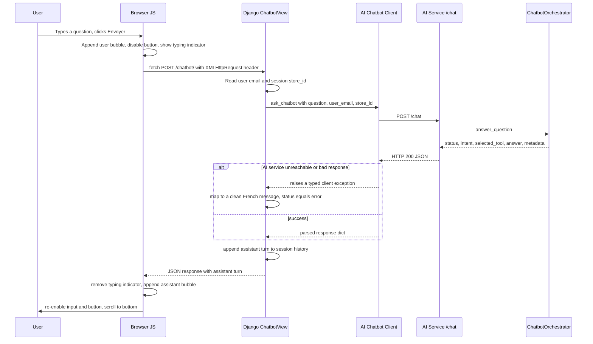

# AI Chatbot — Full Integration (Frontend ↔ AI Service)

## 1. Purpose

This document describes the **complete integration** of the AI chatbot into Pricing Control Tower — Django frontend included — for the RNCP demonstration and defense.

[`ai_chatbot_architecture.md`](ai_chatbot_architecture.md) already documents the AI service (`ai_service`) in depth: orchestrator, business tools, LLM provider, response statuses, security constraints. That document is not duplicated here. This document instead covers what it does not: **how the Django frontend talks to the AI service, end to end**, and how the two sides were built and validated together (T171–T174).

| Sub-task | Covered in |
| --- | --- |
| Document final architecture | Section 2 |
| Document frontend ↔ AI flows | Section 3 |
| Document AI components | Section 4 |
| Document MVP limitations | Section 5 |

## 2. Final architecture

### 2.1 Components

```text
┌─────────────────────────┐        ┌──────────────────────────────────────┐
│  Browser                │        │  Django frontend (this repo's        │
│  /chatbot/ page         │        │  "client" role only)                 │
│  - chatbot.html + JS    │        │                                       │
│    (fetch, no reload)   │  HTTP  │  core/urls.py        → /chatbot/      │
│                         │◄──────►│  core/views.py       → ChatbotView    │
│                         │        │  core/services/                      │
│                         │        │   ai_chatbot_client.py → ask_chatbot()│
└─────────────────────────┘        └──────────────────┬───────────────────┘
                                                       │ POST /chat (HTTP)
                                                       ▼
                                    ┌──────────────────────────────────────┐
                                    │  ai_service (FastAPI)                │
                                    │  app/api/routes/chat.py              │
                                    │  app/orchestrator/                  │
                                    │   chatbot_orchestrator.py            │
                                    │  app/tools/* + app/services/*        │
                                    │  app/llm/groq_provider.py (Groq LLM) │
                                    └──────────────────┬───────────────────┘
                                                       │ HTTP (RBAC-filtered)
                                                       ▼
                                    ┌──────────────────────────────────────┐
                                    │  Business backend (FastAPI)          │
                                    │  used by AnomalyTool only in MVP     │
                                    └──────────────────────────────────────┘
```

Three independent processes, three independent deployment units:

| Component | Process | Port (local) | Owns |
| --- | --- | --- | --- |
| Django frontend | `manage.py runserver` | 8080 (8000 in some local setups) | Display, session, HTTP client to `ai_service` |
| AI service | `uvicorn app.main:app` (or Docker `pct_ai_service`) | 8001 | Intent detection, tool selection, LLM calls, business logic for explanations |
| Business backend | `uvicorn app.main:app` (or Docker, separate compose file) | 8000 | Source of truth for prices, anomalies, roles, KPIs |

### 2.2 The boundary rule

This is the single most important architectural decision and it was enforced across T171–T174:

> **Django is a pure web client for the chatbot. It never detects intent, never selects a business tool, never interprets KPIs/anomalies/RBAC, never calls the business backend directly to answer a chatbot question, and never touches the database for chatbot purposes.**

Everything Django does for the chatbot is: render the page, read the form, call `ask_chatbot()`, store the conversation turn in the session, render the result. All business and AI logic lives in `ai_service`.

### 2.3 End-to-end sequence



## 3. Frontend ↔ AI flows

### 3.1 Configuration

```python
# frontend/config/settings.py
AI_SERVICE_BASE_URL = os.getenv("AI_SERVICE_BASE_URL", "http://localhost:8001")
```

Documented in [`frontend/.env.example`](../../frontend/.env.example). In Docker Compose, this would be `http://ai_service:8001` (service-name resolution); in the current MVP, Django runs on the host and reaches the AI service container via its published port (`localhost:8001`).

### 3.2 Request construction

`core/services/ai_chatbot_client.py` builds the `/chat` payload from what Django actually has, never inventing context:

```python
def build_chat_payload(question, user_email=None, store_id=None):
    payload = {"question": question}
    if user_email:
        payload["user_email"] = user_email
    if isinstance(store_id, int) and store_id > 0:
        payload["store_id"] = store_id
    return payload
```

* `question` — always present, the trimmed form input;
* `user_email` — `request.user.email` from the logged-in Django session, omitted if empty;
* `store_id` — read from `request.session.get("store_id")`; **nothing in the current codebase ever sets this session key**, so it is always omitted today (see section 5.3). This was a deliberate T172 decision: "ne pas inventer de store_id" — better to omit it and let `ai_service` report `missing_context` than to send a guessed value.

The HTTP call itself (`ask_chatbot()`) uses a 30s timeout (LLM calls are slower than typical backend calls) and raises one of two typed exceptions on failure, never a raw `requests` exception:

| Exception | Raised when | User-facing message (set in `ChatbotView`) |
| --- | --- | --- |
| `AiChatbotConnectionError` | Connection refused, DNS failure, timeout | "Le service IA est momentanément indisponible. Veuillez réessayer plus tard." |
| `AiChatbotResponseError` | Non-2xx HTTP status, invalid JSON | "Le service IA a retourné une réponse inattendue. Veuillez réessayer." |
| any other exception | Anything unforeseen | "Une erreur technique est survenue pendant l'appel au chatbot." (logged server-side via `logger.exception`, never shown to the user) |

### 3.3 Conversation state

There is no database table and no AI-side conversation memory. `ChatbotView` keeps the visible history in the **Django session** only:

```python
history = request.session.get("chatbot_history", [])
history.append({"role": "user", "content": question})
history.append(assistant_turn)  # {role, content, status, selected_tool}
request.session["chatbot_history"] = history[-20:]
```

This is purely a UI convenience (so a page reload doesn't lose the visible conversation) — `ai_service` itself answers every question independently, with no memory of previous turns (see section 5.2).

### 3.4 Two transport modes, one view

`ChatbotView.post` supports both, controlled by the `X-Requested-With: XMLHttpRequest` header:

* **AJAX (used by the real UI):** returns `JsonResponse({"assistant": {...}})`. The page never reloads; `chatbot.html`'s JS appends the user bubble immediately, shows a typing indicator, then appends the assistant bubble (or a clean error) when the response arrives.
* **Plain form POST (progressive-enhancement fallback, e.g. JS disabled):** redirects back to `/chatbot/`, which re-renders the full page from the same session history.

### 3.5 Response display

Every assistant bubble shows, in small text under the answer:

```text
Statut : routed
Outil : rbac_tool
```

`Outil` falls back to the literal `none` when `selected_tool` is `null` (e.g. `unsupported`, error cases), so the structure is always present, never conditionally hidden — useful during the RNCP demonstration to show that the orchestrator really does select a tool per question. Error responses (`status="error"`) get a distinct red-tinted bubble instead of the neutral gray one, both in the server-rendered Django template and in the JS-appended path (kept visually consistent between the two).

### 3.6 UX safeguards (T173)

* the send button is disabled and its label changes to "Réponse en cours..." for the duration of the call, with a "Le chatbot analyse votre demande..." typing indicator — both to communicate progress and to prevent double submission;
* the question field has the HTML `required` attribute and the JS checks `question.trim()` before doing anything — an empty question never reaches `ask_chatbot()`, client-side or server-side;
* the chat panel has a fixed, viewport-relative height (`lg:h-[calc(100vh-12rem)]`) with `overflow-y: auto` only on the messages list, so the conversation scrolls internally instead of growing the page.

## 4. AI components

This is a summary; full detail (orchestrator priority order, each tool's data source, LLM provider configuration, response status taxonomy) is in [`ai_chatbot_architecture.md`](ai_chatbot_architecture.md).

| Component | Role | Calls an LLM? | Calls the backend? |
| --- | --- | --- | --- |
| `ChatbotOrchestrator._detect_intent` | Keyword-based routing of the question to an intent | No | No |
| `RBACTool` + `RBACExplanationService` | Explains roles/permissions from a static role table | Yes (phrasing only) | No |
| `BusinessRulesTool` + `BusinessRulesExplanationService` | Explains business rules (e.g. read-only, approval workflow) from a static rule table | Yes (phrasing only) | No |
| `KPITool` + `KPIExplanationService` | Explains KPI definitions from a static KPI table | Yes (phrasing only) | No |
| `AnomalyTool` | Lists store/country price mismatches | No | Yes — the only tool that calls the business backend |
| `GroqLLMProvider` (`llama-3.1-8b-instant`) | Generates the final French wording from facts already retrieved | — | No |

The facts (roles, rules, KPI definitions) are never invented by the LLM — they come from controlled, static, internal data; the LLM only phrases the answer. This is confirmed by `metadata.llm_used` and by the latency difference observed during validation: LLM-backed answers take ~300–900 ms, non-LLM answers (`unsupported`, `missing_context`, `not_implemented`) take ~30 ms (see [`ai_chatbot_end_to_end_validation.md`, section 7.1](../06_validation/ai_chatbot_end_to_end_validation.md#71-metrics-beforeafter)).

## 5. MVP limitations

### 5.1 Frontend-specific limitations (new in this document)

* **No `store_id` propagation.** Django never sends `store_id` to `ai_service` today, because nothing in the codebase populates `request.session["store_id"]`. Every anomaly question asked through the real UI hits `status="missing_context"`, never reaches the backend. This is an intentional T172 choice ("never invent a store_id"), not a bug — but it does mean the anomaly use case cannot be fully demonstrated from the UI alone without first wiring a real store-scope source (e.g. from the user's business profile, already fetched elsewhere in the app via `/me`).
* **No conversation memory sent to the AI.** The session history in Django is display-only; each call to `ask_chatbot()` sends only the current question. A user referring back to a previous answer ("et pour un store director ?") will not be understood as a follow-up.
* **No markdown rendering.** Answers are displayed with `linebreaksbr` (line breaks preserved) but no bullet/heading/bold formatting beyond that, even if the LLM's wording implies structure.
* **Session-only history.** The conversation is lost on logout or session expiry; there is no persistence across devices or sessions.

### 5.2 AI service limitations (recap — see [`ai_chatbot_architecture.md`, section 15](ai_chatbot_architecture.md#15-mvp-limitations) and [`ai_chatbot_monitoring.md`, section 7](../05_runbook/ai_chatbot_monitoring.md#7-current-mvp-limitations) for full detail)

* intent detection is keyword-based, not semantic — see the concrete routing gap found and fixed during [T174](../06_validation/ai_chatbot_end_to_end_validation.md#81-business-rule-question-not-routed-as-expected--fixed);
* `kpi_tool` (country revenue) and `price_change_tool` are recognized but not yet fully connected (`status="not_implemented"`);
* no conversation memory on the AI side either — each `/chat` call is independent;
* metrics reset on every `ai_service` process restart;
* the chatbot depends on an external LLM provider (Groq) for all enriched answers; if Groq is unreachable, tools that need the LLM fail (caught and reported as a clean `status="error"`, not a crash).

### 5.3 Read-only by design (not a limitation — a deliberate constraint)

The chatbot **cannot** apply, approve, or reject a price change, create or stop a promotion, or modify any data — by design, enforced in `ai_service` (see [`chatbot_security_rules.md`](chatbot_security_rules.md)), not by the frontend. Django has no code path that would let the chatbot write to the database even if asked to.

## 6. Acceptance criteria

| Criterion | Status |
| --- | --- |
| Documentation exists | This document, cross-referencing [`ai_chatbot_architecture.md`](ai_chatbot_architecture.md), [`ai_chatbot_monitoring.md`](../05_runbook/ai_chatbot_monitoring.md), [`ai_chatbot_cicd_pipeline.md`](../05_runbook/ai_chatbot_cicd_pipeline.md), [`ai_chatbot_manual_validation.md`](../06_validation/ai_chatbot_manual_validation.md), [`ai_chatbot_end_to_end_validation.md`](../06_validation/ai_chatbot_end_to_end_validation.md), [`chatbot_security_rules.md`](chatbot_security_rules.md) |
| Integration explained | Sections 2 (architecture) and 3 (flows) |
| Limits documented | Section 5 |

## 7. Reference map for the RNCP defense

```text
Functional scope, MVP use cases ........ docs/01_functional/chatbot_use_cases.md
Security rules, refusal behavior ....... docs/03_architecture/chatbot_security_rules.md
AI service architecture (deep dive) .... docs/03_architecture/ai_chatbot_architecture.md
Frontend ↔ AI integration (this doc) ... docs/03_architecture/ai_chatbot_frontend_integration.md
Logs, metrics, Prometheus, Grafana ..... docs/05_runbook/ai_chatbot_monitoring.md
CI/CD pipeline for ai_service ........... docs/05_runbook/ai_chatbot_cicd_pipeline.md
ai_service /chat validation (isolated) . docs/06_validation/ai_chatbot_manual_validation.md
Full chain validation + fixes applied .. docs/06_validation/ai_chatbot_end_to_end_validation.md
```
