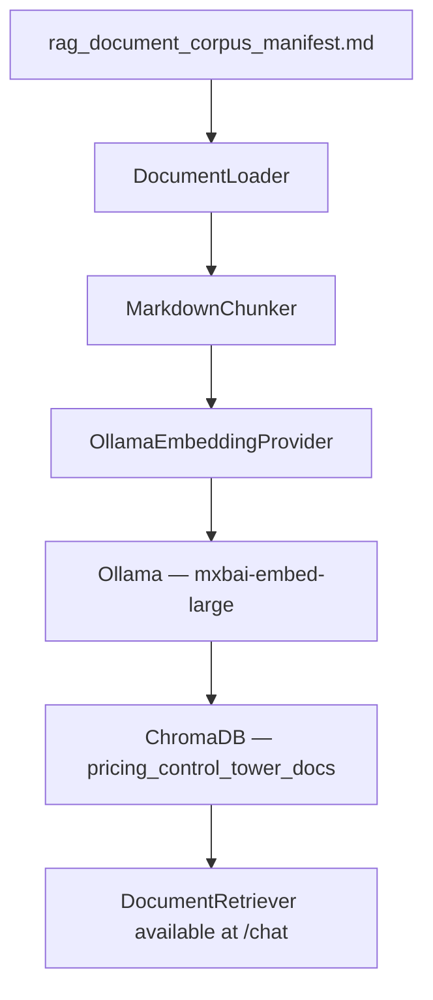
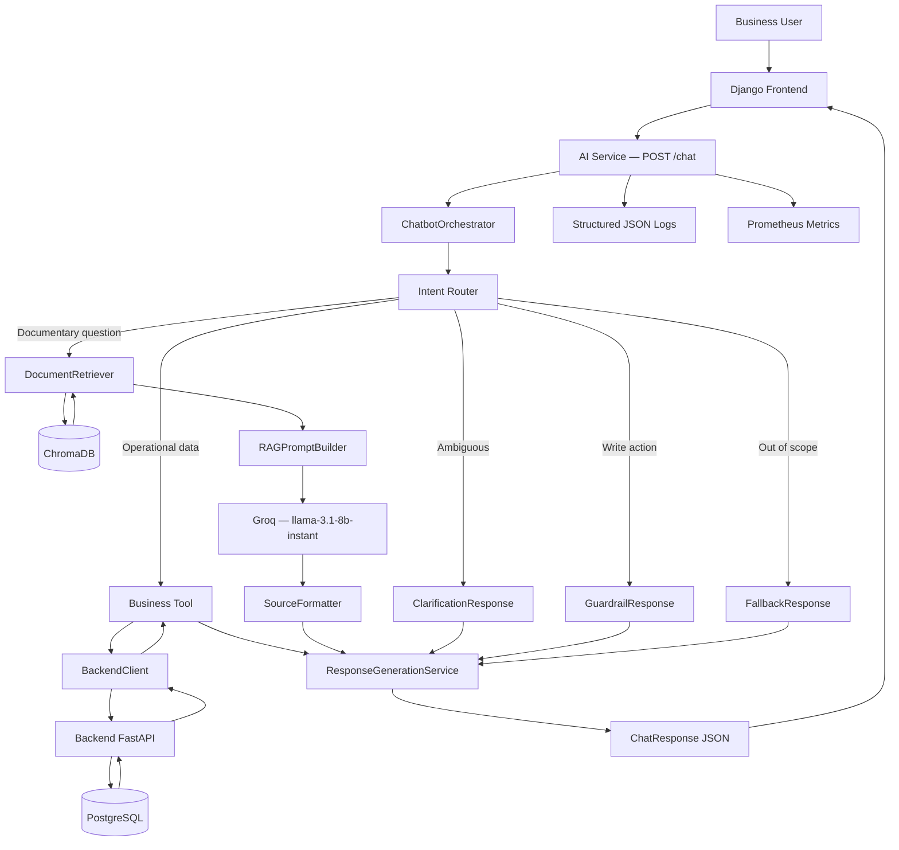
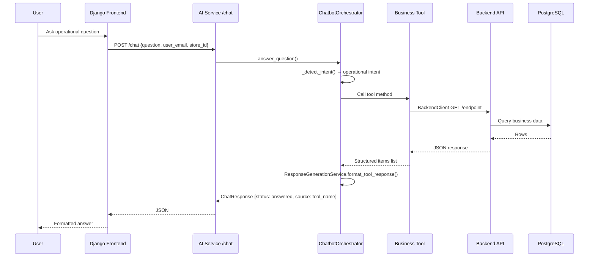
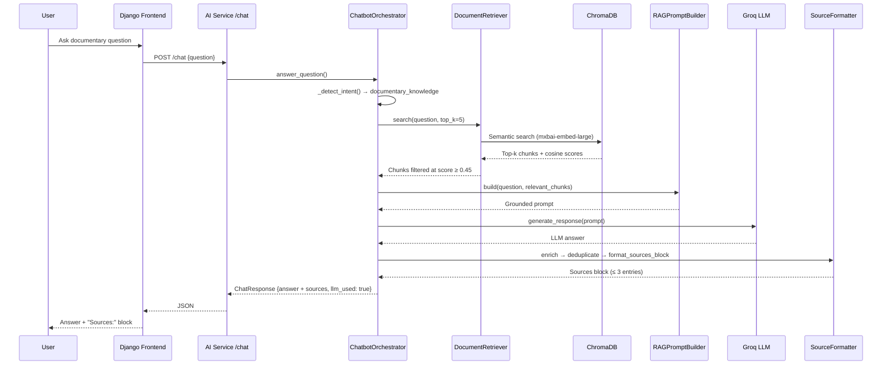
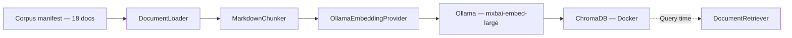

# AI Chatbot — Hybrid Architecture: Tool Calling + RAG + LLM

## 1. Purpose

This document defines the final architecture of the Pricing Control Tower chatbot after
Sprint 13 (T193–T206). It is the reference for understanding how the three mechanisms
coexist: Tool Calling for live operational data, RAG for documentary knowledge, and LLM
for natural-language response generation.

The document also serves as RNCP evidence and a defence support for the project.

The chatbot must handle three distinct question types:

| Question type | Source of truth | Mechanism |
|---|---|---|
| Live operational data | Backend API / PostgreSQL | Tool Calling |
| Documentary knowledge | Project documentation (18 documents) | RAG |
| Response wording and synthesis | LLM (grounded, not free) | Controlled generation |

**Core principle:** Tool Calling takes absolute priority for operational data.
RAG is strictly reserved for documentary questions.
The two flows must never be swapped.
The chatbot is read-only — it never executes business actions.

---

## 2. Architecture overview

```
User
→ Django Frontend
→ AI Service  POST /chat
→ ChatbotOrchestrator
    → _detect_intent()
        ↓ guardrail?         → GuardrailResponse (read-only explanation)
        ↓ clarification?     → ClarificationResponse (targeted prompt)
        ↓ operational tool?  → Business Tool → BackendClient → Backend API
        ↓ documentary?       → DocumentRetriever → ChromaDB → RAGPromptBuilder → LLM
        ↓ unknown?           → FallbackResponse (supported topics listed)
→ ResponseGenerationService  (formats the final answer)
→ ChatResponse (JSON)
→ Django Frontend renders answer + optional source block
```

---

## 3. Main components

| Component | File | Role |
|---|---|---|
| `ChatbotOrchestrator` | `ai_service/app/orchestrator/chatbot_orchestrator.py` | Central dispatcher — detects intent and calls the right tool or RAG |
| `ResponseGenerationService` | `ai_service/app/services/response_generation_service.py` | Formats tool answers, guardrail messages, clarifications, fallbacks |
| `AnomalyTool` | `ai_service/app/tools/anomaly_tool.py` | Price mismatches between store and country reference |
| `KPITool` / `KPIExplanationService` | `ai_service/app/tools/kpi_tool.py` | Revenue, margin, KPI figures |
| `BusinessRulesExplanationService` | `ai_service/app/services/business_rules_explanation_service.py` | Business rule and validation workflow explanations |
| `RBACExplanationService` | `ai_service/app/services/rbac_explanation_service.py` | Role, permission, and scope explanations |
| `ReferenceDataTool` | `ai_service/app/tools/reference_data_tool.py` | Master data: countries, stores, products, product families |
| `PriceChangeRequestTool` | `ai_service/app/tools/price_change_request_tool.py` | Price change requests filtered by status |
| `PromotionTool` | `ai_service/app/tools/promotion_tool.py` | Promotion listings, active / scoped |
| `PriceTool` | `ai_service/app/tools/price_tool.py` | Price entries by product / store / country |
| `BackendClient` | `ai_service/app/clients/backend_client.py` | HTTP client for backend API calls |
| `DocumentRetriever` | `ai_service/app/rag/retriever.py` | Semantic similarity search over ChromaDB |
| `RAGPromptBuilder` | `ai_service/app/rag/prompt_builder.py` | Builds the LLM prompt from retrieved chunks |
| `SourceFormatter` | `ai_service/app/rag/source_formatter.py` | Enriches, deduplicates, and renders source blocks |
| `DocumentLoader` | `ai_service/app/rag/document_loader.py` | Reads corpus files from disk |
| `MarkdownChunker` | `ai_service/app/rag/chunker.py` | Splits documents into exploitable passages |
| `OllamaEmbeddingProvider` | `ai_service/app/rag/embeddings/ollama_provider.py` | Dense vector generation via Ollama |
| `BaseEmbeddingProvider` | `ai_service/app/rag/embeddings/base.py` | Abstract contract for swappable embedding providers |
| `ChromaDB Vector Store` | `ai_service/app/rag/vector_store.py` | Persisted embedding store (Docker service) |
| `BaseLLMProvider` / `GroqProvider` | `ai_service/app/llm/` | Abstract LLM contract + Groq implementation |
| `Django Frontend` | `frontend/core/views.py` | Sends questions to `/chat`, renders responses and source blocks |
| Structured logs | `ai_service/app/core/logging_config.py` | JSON events per request (routing decisions, tool used, latency) |
| Prometheus metrics | `ai_service/app/core/metrics.py` | Chat tool usage counters |

---

## 4. Tool Calling layer

### 4.1 Principle

When the detected intent targets live business data, the orchestrator delegates to a
dedicated tool. The tool calls the backend via `BackendClient`, which performs an
authenticated HTTP GET request. No RAG retriever is involved. No LLM prompt is built
from documents.

### 4.2 Business tools

#### AnomalyTool

- **Purpose:** list price mismatches where a store price exceeds the country reference
- **Backend endpoint:** `GET /store-country-price-mismatches`
- **Context required:** `user_email` + `store_id` (RBAC-enforced)
- **Questions covered:** "Show anomalies for store 1", "List price mismatches"

#### KPITool / KPIExplanationService

- **Purpose:** retrieve revenue, margin, and other KPI figures; explain KPI formulas
- **Backend endpoint:** `GET /revenues`, `GET /kpis`
- **Questions covered:** "What is the revenue for France?", "Explain the uplift KPI"

#### BusinessRulesExplanationService

- **Purpose:** explain the price change validation workflow and business constraints
- **Questions covered:** "Can the chatbot approve a price change?", "How is a request validated?"

#### RBACExplanationService

- **Purpose:** explain roles, permissions, and data-scope rules
- **Questions covered:** "Explain store manager permissions", "What can a pricing analyst access?"

#### ReferenceDataTool (T199)

- **Purpose:** serve master-data lookups: countries, stores, products, product families
- **Backend endpoints:** `GET /countries`, `GET /stores`, `GET /products`, `GET /product-families`
- **Questions covered:** "List countries", "What stores are available?", "Show product families", "List active products"
- **Routing:** intent `reference_data` — checked before RAG

#### PriceChangeRequestTool (T200)

- **Purpose:** list price change requests, filterable by status
- **Backend endpoint:** `GET /price-change-requests`
- **Filters forwarded:** `status` (PENDING / APPROVED / REJECTED), `product_id`, `store_id`, `country_id`
- **Questions covered:** "List pending price change requests", "Show approved requests"
- **Routing:** intent `list_store_price_changes`

#### PromotionTool (T200)

- **Purpose:** list promotions, active or scoped by store / product
- **Backend endpoint:** `GET /promotions`
- **Filters forwarded:** `active`, `store_id`, `country_id`, `product_id`
- **Questions covered:** "List active promotions", "Promotions for store 2"
- **Routing:** intent `promotions`

#### PriceTool (T200)

- **Purpose:** list current price entries
- **Backend endpoint:** `GET /prices`
- **Filters forwarded:** `product_id`, `store_id`, `country_id`
- **Questions covered:** "List prices for product 3", "Prices for store 2"
- **Routing:** intent `prices`

### 4.3 Response formatting

Tool output is formatted by the `ResponseGenerationService` into a structured text block:
a one-line summary, a bulleted detail list, and an optional suggested next step. No LLM
call is made for tool responses — the structure is assembled in code.

---

## 5. RAG documentary layer

### 5.1 Principle

When the detected intent targets documentary knowledge (workflows, business rules,
architecture, monitoring, RBAC definitions), the orchestrator calls the `DocumentRetriever`.
Relevant chunks are assembled into a prompt by `RAGPromptBuilder`, and the LLM produces
a grounded answer. The source block is appended by `SourceFormatter`.

### 5.2 Document corpus

The RAG corpus contains **18 selected documents** from the project repository.
Selection criteria: business knowledge, architecture explanations, workflows, RBAC
definitions, monitoring runbooks, chatbot usage. Entity-relationship models, SQL schemas,
and Agile backlogs are explicitly excluded.

Full manifest: [`docs/05_ai/rag_document_corpus_manifest.md`](../05_ai/rag_document_corpus_manifest.md)

Key retained documents (by domain):

| Domain | Examples |
|---|---|
| Architecture | `ai_chatbot_hybrid_rag_architecture.md`, `architecture_overview.md`, `ai_chatbot_architecture.md` |
| Business rules | `pricing_workflow.md`, `anomaly_business_rules.md` |
| RBAC | `authentication_rbac_architecture.md`, `rbac_roles_permissions.md` |
| Monitoring | `application_observability_architecture.md`, `ai_chatbot_monitoring.md` |
| Chatbot usage | `chatbot_use_cases.md`, `chatbot_security_rules.md` |

### 5.3 RAG pipeline components

#### DocumentLoader (`rag/document_loader.py`)

Reads Markdown files from the corpus manifest. Each document is loaded with its source
path as metadata so chunks can trace back to their origin document.

#### MarkdownChunker (`rag/chunker.py`)

Splits documents into passages at Markdown heading boundaries. Each chunk is small enough
to fit into the LLM context but large enough to carry complete reasoning units.

#### BaseEmbeddingProvider / OllamaEmbeddingProvider (`rag/embeddings/`)

`BaseEmbeddingProvider` is an abstract class with a single method: `embed_texts(texts)`.
The factory resolves the concrete provider from `settings.embedding_provider`.

Current implementation: **OllamaEmbeddingProvider** — sends texts to a local Ollama
service and returns dense vectors using model `mxbai-embed-large`.

The provider abstraction allows swapping to a cloud embedding API without touching
the retriever or vector store.

#### ChromaDB Vector Store (`rag/vector_store.py`)

Embedding vectors and their chunk metadata are stored in ChromaDB, running as a Docker
service (`chromadb` in `docker-compose.yml`). The collection name is
`pricing_control_tower_docs`. ChromaDB is accessed via the Python SDK at indexing time
and at query time by the retriever.

Indexing command:

```bash
cd ai_service
uv run python scripts/index_rag_documents.py --reset
```

#### DocumentRetriever (`rag/retriever.py`)

At query time, the retriever embeds the user question with the same Ollama provider,
queries ChromaDB for the `rag_top_k` closest chunks by cosine similarity, and filters
out any chunk below `rag_min_score`.

| Config parameter | Value | Description |
|---|---|---|
| `rag_top_k` | 5 | Maximum chunks retrieved per query |
| `rag_min_score` | 0.45 | Minimum cosine similarity to keep a chunk |
| `rag_max_context_chars` | 6 000 | Maximum characters of context injected into the prompt |
| `rag_max_displayed_sources` | 3 | Maximum source references shown to the user |

If no chunk passes the `rag_min_score` threshold, the orchestrator returns a fixed fallback
message without calling the LLM — no hallucination risk.

#### RAGPromptBuilder (`rag/prompt_builder.py`)

Assembles the final prompt from the retrieved chunks and the user question. The prompt
instructs the LLM to answer strictly from the provided context, cite sources, and decline
to invent facts absent from the passages.

#### SourceFormatter (`rag/source_formatter.py`)

After the LLM produces its answer, the formatter:
1. Enriches each chunk with human-readable source metadata (document title, section)
2. Deduplicates sources that refer to the same document
3. Formats a `Sources:` block appended below the LLM answer
4. Limits output to `rag_max_displayed_sources` entries

### 5.4 Indexing flow



---

## 6. LLM response generation

| Setting | Value |
|---|---|
| Provider | Groq (`BaseLLMProvider` / `GroqProvider`) |
| Model | `llama-3.1-8b-instant` |
| LLM called for | RAG documentary answers; and KPI / business-rule / RBAC explanations once a keyword match is found (see below) |
| LLM not called for | Live-data tools (`AnomalyTool`, `PriceTool`, `PromotionTool`, `PriceChangeRequestTool`, `ReferenceDataTool`, `KPIDataTool`), guardrail, clarification, fallback, and static responses (`chatbot_capabilities`, `chatbot_limits`, `decision_kpi_guidance`) |

`KPIExplanationService`, `BusinessRulesExplanationService` and `RBACExplanationService`
(§4.2) are grouped under "Tool Calling" above because they never touch ChromaDB, but they
do call the LLM to turn a keyword-matched dictionary entry into prose — they are **not**
RAG despite answering conceptual questions. This distinction (and the RBAC static
short-circuit that skips the LLM entirely for 8 exact-match patterns) is exactly why "RAG"
gets misused as an umbrella term; see
[Chatbot Response Mechanisms](../05_ai/chatbot_response_mechanisms.md) for the disambiguation
table. All non-LLM response types are assembled directly by `ResponseGenerationService`
from structured data or constant message strings defined in `chatbot_messages.py`. This
keeps latency low and hallucination risk bounded outside the two mechanisms above.

---

## 7. Intent routing rules

### 7.1 Detection order

The orchestrator's `_detect_intent()` evaluates conditions in strict priority order.
The first match wins.

```
0. Guardrail — direct write-action phrases ("approve request", "reject this", "apply this", …)
   → guardrail_action_request

1. RBAC — role, permission, store manager, country director, scope, access, rights, …
   → explain_rbac

2. Business rules — business rule, chatbot approve, validation workflow, audit, traceability, …
   → explain_business_rule

3. Price mismatches / anomalies — mismatch, anomaly, anomalies, price above, …
   → list_store_country_price_mismatches

4. Price change requests — pending price, price change request, change requests, …
   → list_store_price_changes

5. KPI — kpi, indicator, metric, margin, performance, …
   → explain_kpi

6. Promotions (scoped) — active promotions, promotions for store/product, …
   → promotions

7. Prices (scoped) — prices for product, prices for store, …
   → prices

8. Reference data — list countries, product famil, list stores, list products, …
   → reference_data

9. Documentary knowledge — monitoring, architecture, price change workflow, chatbot capabilities, …
   → documentary_knowledge

10. Revenue intent (regex) — revenue, turnover, chiffre d'affaires, \bca\b
    → get_country_revenue

11. Granular clarification (T203)
    — exact-match bare commands  → clarify_prices / clarify_promotions / clarify_price_requests
    — substring entity phrases   → clarify_store / clarify_product

12. Generic ambiguous fallback
    → ambiguous_question

13. No match
    → unknown  (unsupported response)
```

### 7.2 Clarification system (T203)

When a question names a recognised topic but lacks the scope needed to call a tool safely,
the orchestrator returns a targeted clarification message instead of guessing.

| Exact trigger | Intent | Message constant |
|---|---|---|
| `"show prices"`, `"list prices"`, `"explain price"` | `clarify_prices` | `CHATBOT_PRICE_CLARIFICATION_MESSAGE` |
| `"show promotions"`, `"list promotions"` | `clarify_promotions` | `CHATBOT_PROMOTION_CLARIFICATION_MESSAGE` |
| `"show requests"`, `"list requests"` | `clarify_price_requests` | `CHATBOT_PRICE_REQUEST_CLARIFICATION_MESSAGE` |
| `"tell me about store …"` | `clarify_store` | `CHATBOT_STORE_CLARIFICATION_MESSAGE` |
| `"tell me about product …"` | `clarify_product` | `CHATBOT_PRODUCT_CLARIFICATION_MESSAGE` |

Bare commands are matched with exact-match sets so that scoped variants
(`"list prices for product 3"`) fall through to the price tool without interception.

### 7.3 Contextual suggestions (T204)

The Django frontend injects page-context suggestions into the chatbot sidebar. These are
static strings — no LLM, no RAG, no backend call. The `?page=` query parameter on
`/chatbot` selects the suggestion set:

| `?page=` | Suggestion topics |
|---|---|
| `prices` | Product prices, price change workflow, price scope rules |
| `promotions` | Active promotions, promotion documentation, guardrail |
| `price_change_requests` | Pending requests, workflow, guardrail |
| `anomalies` | Store anomalies, anomaly definitions, review priority |
| *(default)* | Chatbot capabilities, RBAC, price change workflow |

Clicking a suggestion fills the input and auto-submits the form via `requestSubmit()`.

---

## 8. Data flows

### 8.1 Architecture diagram



### 8.2 Tool Calling sequence



### 8.3 RAG documentary sequence



### 8.4 RAG indexing flow



---

## 9. Read-only guardrails

### 9.1 Principle

The chatbot is structurally read-only. No tool writes to the database. No backend
endpoint with side effects is called. The guardrail check runs first in `_detect_intent()`
— before any tool or RAG path — so write-intent phrases are blocked unconditionally.

### 9.2 Actions the chatbot will never execute

```
- approve a price change request
- reject a price change request
- apply a price change
- create a promotion
- modify a product or price
- delete any record
```

### 9.3 Guardrail phrase detection

The orchestrator maintains `_GUARDRAIL_PHRASES`, a curated list of English and French
direct-command phrases:

```python
"approve request", "reject request", "approve this", "reject this",
"apply this", "apply the change", "apply the price",
"can you approve", "can you reject", "can you apply",
"can you modify", "can you create", "can you delete",
"please approve", "please reject", "please apply",
"approuve cette", "approuve la demande", "rejette cette", "rejette la demande",
"applique cette", "applique le changement",
"valide cette demande", "valide la demande",
```

Any question containing one of these phrases returns `status: guardrail` with
`CHATBOT_GUARDRAIL_MESSAGE` — no tool is called, no backend request is made.

### 9.4 RBAC context enforcement

Every request forwarded to a business tool carries `user_email` and `store_id`. The
backend applies RBAC at query time: a store manager receives only data from their own
store. The AI service never bypasses this check.

---

## 10. Monitoring and logging

| Mechanism | Implementation | What is captured |
|---|---|---|
| Structured JSON logs | `logging_config.py` — `log_event()` | `chat_tool_selected` event: intent, tool name, context flags |
| Prometheus counter | `metrics.py` — `increment_chat_tool_usage_total()` | Tool usage per tool name, per request |
| RAG search event | Logged in `_answer_documentary_question()` | Chunks retrieved, chunks relevant, `rag_min_score` |
| Error events | `_build_error_response()` | Error type, intent, tool at failure point |
| Frontend middleware | `frontend/core/middleware/` | Request duration, status code, path, user_email |

Monitoring runbook: [`docs/05_runbook/ai_chatbot_monitoring.md`](../05_runbook/ai_chatbot_monitoring.md)

---

## 11. Tests and validation evidence

### 11.1 Automated test results (T205 — 2026-07-01)

```
ai_service   362 tests passed   (uv run --python 3.14 pytest)
frontend      23 tests passed   (uv run python manage.py test core)
```

### 11.2 Test coverage by component

| Suite | File | Tests |
|---|---|---|
| Orchestrator routing | `tests/orchestrator/test_chatbot_orchestrator.py` | Intent detection, tool selection, guardrails, clarifications |
| Response generation | `tests/services/test_response_generation_service.py` | All response format methods |
| RAG prompt builder | `tests/rag/test_prompt_builder.py` | Prompt assembly |
| RAG source formatter | `tests/rag/test_source_formatter.py` | Enrichment, deduplication, rendering |
| Chat endpoint | `tests/api/test_chat_endpoint.py` | FastAPI contract |
| PriceChangeRequestTool | `tests/tools/test_price_change_request_tool.py` | Status filtering, empty results |
| PromotionTool | `tests/tools/test_promotion_tool.py` | Active/inactive, discount types |
| PriceTool | `tests/tools/test_price_tool.py` | Price formatting |
| ReferenceDataTool | `tests/tools/test_reference_data_tool.py` | Countries, stores, products, families |
| AnomalyTool | `tests/tools/test_anomaly_tool.py` | Mismatch listing |
| Frontend chatbot view | `frontend/core/tests.py` | View responses, suggestions, error handling |

### 11.3 Manual business validation (T205)

29 questions validated across all families:

| Family | Count | IDs |
|---|---|---|
| RAG documentary | 6 | RAG-01 → RAG-06 |
| Tool Calling (T200) | 8 | TOOL-01 → TOOL-08 |
| Reference data (T199) | 4 | REF-01 → REF-04 |
| Ambiguity / clarification (T203) | 5 | CLAR-01 → CLAR-05 |
| Guardrails (T201) | 4 | GUARD-01 → GUARD-04 |
| Fallbacks | 2 | FALLBACK-01 → FALLBACK-02 |

Full matrix: [`docs/06_validation/chatbot_business_use_cases_validation.md`](../06_validation/chatbot_business_use_cases_validation.md)

### 11.4 Prior validation documents

| Document | Sprint | Scope |
|---|---|---|
| `rag_vector_search_manual_validation.md` | T195 | ChromaDB retrieval quality |
| `rag_orchestrator_integration_validation.md` | T196 | RAG + orchestrator integration |
| `rag_prompt_context_validation.md` | T197 | Prompt assembly |
| `rag_sources_display_validation.md` | T198 | Source block rendering |
| `reference_data_tool_validation.md` | T199 | ReferenceDataTool |
| `business_tools_extension_validation.md` | T200 | PriceChangeRequestTool, PromotionTool, PriceTool |
| `intent_routing_fallback_validation.md` | T201 | Routing matrix and guardrails |
| `chatbot_ambiguity_handling_validation.md` | T203 | Granular clarification detection |
| `chatbot_suggestions_validation.md` | T204 | Page-context suggestions |
| `chatbot_business_use_cases_validation.md` | T205 | Full business use-case matrix |

---

## 12. Known limitations

| # | Limitation | Impact |
|---|---|---|
| L-01 | Keyword "anomalies" in definitional questions routes to `AnomalyTool` instead of RAG. Without user context, this returns `missing_context`. | "How are anomalies defined?" does not yield a documentary answer. |
| L-02 | "Create a new promotion." (without "can you") is not matched by a guardrail phrase. It falls through to `unknown → unsupported`. The action is never performed, but the response is less explicit than a guardrail. | Safety property holds; response quality is reduced. |
| L-03 | No multi-turn memory. Each question is processed independently with no awareness of previous turns. | Follow-up questions must be self-contained. |
| L-04 | Clarification responses do not retain context from the preceding question. | Users must re-state the full question after a clarification prompt. |
| L-05 | RAG answer quality depends on the corpus being indexed. Stale or missing indexing produces fallback answers. | Requires running `index_rag_documents.py` after corpus updates. |
| L-06 | `AnomalyTool` requires `user_email` and `store_id` in the request context. Direct API calls without these fields return `missing_context`. | API callers must provide both fields; the frontend session handles this automatically. |
| L-07 | Suggestions are page-based, not role-based. A store manager and a pricing analyst see identical suggestions on the same page. | Future enhancement: role-aware suggestion filtering. |
| L-08 | ChromaDB runs as a Docker service. The Python SDK version must remain compatible with the Docker image version. | Controlled by `docker-compose.yml`; tested together. |
| L-09 | Embeddings use Ollama locally (`mxbai-embed-large`). Indexing requires the Ollama service to be running. | Cloud embedding API can be added via a new `BaseEmbeddingProvider` implementation without changing the retriever. |

---

## 13. Separation between operational data and documentary knowledge

| Dimension | Operational data — Tool Calling | Documentary knowledge — RAG |
|---|---|---|
| **Source** | PostgreSQL via backend API | 18 Markdown documents in the repository |
| **Freshness** | Real-time (live query per request) | As-of last `index_rag_documents.py` run |
| **Examples** | Promotions, prices, requests, countries | Pricing workflow, RBAC rules, KPI formulas |
| **Authoritative path** | `BackendClient` → Backend FastAPI | `DocumentRetriever` → ChromaDB |
| **LLM role** | Not used — structured formatting only | Answer synthesis grounded in retrieved text |
| **Failure mode** | Tool error → structured error message | No chunk above threshold → fixed fallback, no hallucination |
| **Sources displayed** | Never (live data, no document reference) | Always (≤ 3 source references appended) |

---

## 14. Related documents

- [Architecture Overview](architecture_overview.md)
- [AI Chatbot Architecture](ai_chatbot_architecture.md)
- [AI Chatbot Frontend Integration](ai_chatbot_frontend_integration.md)
- [Chatbot Security Rules](chatbot_security_rules.md)
- [Chatbot Response Mechanisms](../05_ai/chatbot_response_mechanisms.md) — disambiguates the "RAG" label across the three response mechanisms
- [RAG Document Corpus Manifest](../05_ai/rag_document_corpus_manifest.md)
- [RAG Vector Indexing](../05_ai/rag_vector_indexing.md)
- [AI Chatbot Monitoring Runbook](../05_runbook/ai_chatbot_monitoring.md)
- [Business Use Cases Validation (T205)](../06_validation/chatbot_business_use_cases_validation.md)
