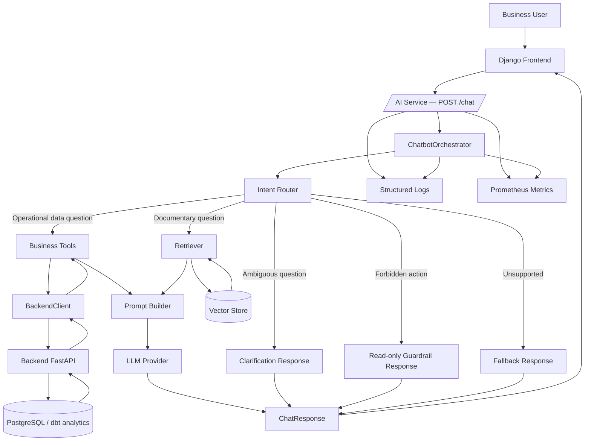

# AI Chatbot — Hybrid Architecture: Tool Calling + RAG + LLM

## 1. Objective

This document defines the target architecture for the Pricing Control Tower chatbot.
It describes how the system integrates a **documentary RAG layer** alongside the existing
**Tool Calling** mechanism, without replacing it.

The chatbot must handle three distinct question types:

| Question type             | Source of truth          | Mechanism              |
| ------------------------- | ------------------------ | ---------------------- |
| Dynamic business data     | Backend / business tools | Tool Calling           |
| Documentary knowledge     | Project documentation    | RAG                    |
| Reformulation / synthesis | LLM                      | Controlled generation  |

**Core principle:** Tool Calling takes absolute priority for operational data questions.
RAG is strictly reserved for documentary knowledge. The two flows must never be swapped.

---

## 2. Components

| Component              | Role                                                                   |
| ---------------------- | ---------------------------------------------------------------------- |
| `Django Frontend`      | Sends user questions to `POST /chat`                                   |
| `AI Service / FastAPI` | Exposes the `/chat` endpoint; collects structured logs and metrics     |
| `ChatbotOrchestrator`  | Analyses intent and dispatches to the correct flow                     |
| `Intent Router`        | Distinguishes Tool Calling, RAG, fallback, or clarification            |
| `Business Tools`       | `BusinessRulesTool`, `KPITool`, `RBACTool`, `AnomalyTool`             |
| `BackendClient`        | HTTP client toward the backend FastAPI (data queries)                  |
| `Document Loader`      | Loads business and technical documents (Markdown, PDF, etc.)           |
| `Chunking Service`     | Splits documents into exploitable passages                             |
| `Embedding Service`    | Converts chunks into dense vectors                                     |
| `Vector Store`         | Stores embeddings and their metadata (e.g. ChromaDB, pgvector)        |
| `Retriever`            | Searches the Vector Store for the most relevant passages               |
| `Prompt Builder`       | Assembles the final prompt: retrieved context + user question          |
| `LLM Provider`         | Generates the final natural-language answer (Groq / llama-3.1)        |
| `Monitoring / Logs`    | Traces routing decisions, errors, and latencies (Prometheus + Loki)   |

**Existing implementations to reference:**

- [`ai_service/app/orchestrator/chatbot_orchestrator.py`](../../ai_service/app/orchestrator/chatbot_orchestrator.py) — `ChatbotOrchestrator`
- [`ai_service/app/tools/`](../../ai_service/app/tools/) — `AnomalyTool`, `BusinessRulesTool`, `KPITool`, `RBACTool`
- [`ai_service/app/llm/`](../../ai_service/app/llm/) — `GroqProvider`, `LLMFactory`, `BaseLLMProvider`
- [`ai_service/app/clients/backend_client.py`](../../ai_service/app/clients/backend_client.py) — `BackendClient`

---

## 3. Architecture diagram



---

## 4. Tool Calling flow

Applies to questions requiring **live operational data** from the backend.

```text
User
→ Django Frontend
→ POST /chat
→ ChatbotOrchestrator
→ Intent Router  (intent: operational)
→ Business Tool  (AnomalyTool | KPITool | BusinessRulesTool | RBACTool)
→ BackendClient
→ Backend FastAPI
→ PostgreSQL / dbt analytics views
→ Business Tool response
→ Prompt Builder
→ LLM Provider  (reformulation / formatting)
→ ChatResponse
```

**Example questions handled by this flow:**

- "Quel est le chiffre d'affaires de la France ?"
- "Liste les anomalies du magasin 3."
- "Quels sont les produits avec un prix supérieur au prix pays ?"
- "Quelles promotions sont actives ?"
- "Quel est le statut d'une demande de changement de prix ?"

> **Rule:** RAG must never answer these questions in place of business tools.
> If the data exists in the backend, Tool Calling is the only authorised path.

---

## 5. Documentary RAG flow

Applies to questions requiring **knowledge encoded in project documentation**.

```text
User
→ Django Frontend
→ POST /chat
→ ChatbotOrchestrator
→ Intent Router  (intent: documentary)
→ Retriever
→ Vector Store   (semantic similarity search)
→ Relevant document chunks (with source metadata)
→ Prompt Builder (context + question)
→ LLM Provider   (answer grounded in retrieved passages)
→ ChatResponse   (answer + document references)
```

**Example questions handled by this flow:**

- "Explique la règle de pricing store vs country."
- "Comment fonctionne le workflow de changement de prix ?"
- "Quels sont les rôles et permissions ?"
- "Comment est calculé le KPI uplift promo ?"
- "Explique l'architecture du chatbot."
- "Quelles sont les limites MVP ?"

> **Rule:** RAG answers must always cite the source document chunk.
> The LLM must not hallucinate facts absent from the retrieved passages.

---

## 6. Routing rules

### 6.1 Intent-to-flow mapping

| Detected intent                                                       | Flow                              |
| --------------------------------------------------------------------- | --------------------------------- |
| Revenue, sales, margin, prices, promotions, anomalies                 | Tool Calling                      |
| Documented business rules (pricing logic, workflows)                  | RAG                               |
| Architecture, API, monitoring, RBAC definitions, KPI calculations     | RAG                               |
| Direct action: approve, apply, modify, delete                         | Refused — read-only guardrail     |
| Ambiguous or underspecified question                                  | Clarification request             |
| No matching tool and no relevant document                             | Reliable fallback                 |

### 6.2 Priority order

```text
1. Safety / read-only guardrails          ← always evaluated first
2. Tool Calling                           ← if question targets operational data
3. RAG                                    ← if question targets documentary knowledge
4. Clarification                          ← if intent is ambiguous
5. Fallback                               ← if nothing matches
```

---

## 7. Security constraints and guardrails

The following constraints apply regardless of the active flow:

| Constraint                     | Description                                                                         |
| ------------------------------ | ----------------------------------------------------------------------------------- |
| **Read-only**                  | The chatbot never writes, modifies, or deletes data. All tools are read-only.       |
| **Prompt injection prevention**| User input is never interpolated directly into system prompts without sanitisation. |
| **RBAC context enforcement**   | Every request carries `user_email` and `store_id`; tools apply RBAC at query time. |
| **No data leakage across stores** | A store manager receives only data scoped to their store(s).                    |
| **Source grounding for RAG**   | LLM answers from the RAG flow must reference the retrieved chunk; invention is blocked by the system prompt. |
| **Fallback on uncertainty**    | When confidence is low, the chatbot returns a scoped fallback, not a hallucinated answer. |

---

## 8. Separation between operational data and documentary knowledge

| Dimension             | Operational data (Tool Calling)                | Documentary knowledge (RAG)                      |
| --------------------- | ---------------------------------------------- | ------------------------------------------------ |
| **Source**            | PostgreSQL / dbt analytical views via backend  | Markdown / PDF project documentation             |
| **Freshness**         | Real-time (live query)                         | As-of last indexing run                          |
| **Examples**          | Revenue figures, anomaly list, active promos   | Pricing rules, workflow descriptions, KPI formulas |
| **Authoritative path**| `BackendClient` → Backend FastAPI              | `Retriever` → `Vector Store`                     |
| **LLM role**          | Reformulate and format structured data         | Synthesise and ground answer in retrieved text   |
| **Failure mode**      | Tool error → structured error message          | No relevant chunk → fallback, no hallucination   |

---

## 9. Related documents

- [Architecture Overview](architecture_overview.md)
- [AI Chatbot Architecture](ai_chatbot_architecture.md)
- [AI Chatbot Frontend Integration](ai_chatbot_frontend_integration.md)
- [Chatbot Security Rules](chatbot_security_rules.md)
- [AI Chatbot Monitoring Runbook](../05_runbook/ai_chatbot_monitoring.md)
