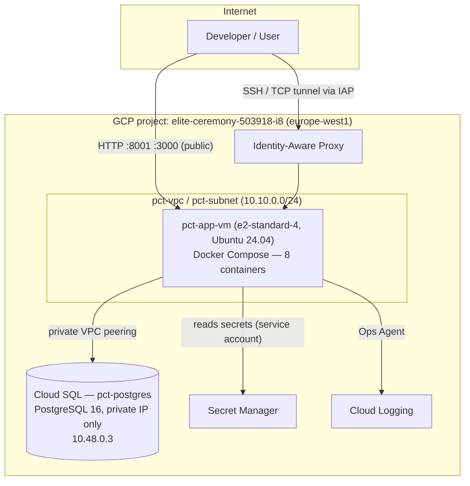

# GCP Cloud Architecture — Pricing Control Tower

Sprint 14 deployment: Compute Engine + Cloud SQL, provisioned entirely via Terraform (`infra/terraform/`), application deployed via Docker Compose (`infra/compose/`).

---

## 1. Overview



The application stack (backend, frontend, ai_service, chromadb, ollama, monitoring) runs as Docker Compose containers on a single Compute Engine VM. PostgreSQL is a managed Cloud SQL instance, reachable only over the private VPC — never over the public internet.

---

## 2. Architecture decisions and justifications

### 2.1 Compute Engine + Docker Compose, not GKE or Cloud Run

Both were considered and deliberately ruled out:

- **cAdvisor requires host-level access** (`docker.sock`, `/rootfs`, `/sys`, `/var/lib/docker`) to report per-container metrics. This works natively on a VM; it doesn't exist on Cloud Run (no host access at all), and on GKE it would need a privileged DaemonSet with hostPath mounts — friction for no real benefit, since GKE nodes already expose equivalent metrics via kubelet.
- **Ollama and ChromaDB are stateful, resource-heavy services.** Cold-start latency makes them a poor fit for Cloud Run's scale-to-zero model, and they need persistent disk, which is native on a VM.
- A single VM keeps the existing `docker-compose.yml` orchestration close to identical between local and production, minimizing risk of behavior drift.
- The sprint's explicit requirement — "monitoring must behave the same way as locally" — is easiest to satisfy with the same container topology, not a re-architected one.

Trade-off accepted: no automatic horizontal scaling. Not a stated requirement for this sprint (availability, security, and observability were; elasticity was not).

### 2.2 Cloud SQL (managed) instead of a containerized PostgreSQL

Automated backups, point-in-time recovery, and private-network isolation come out of the box, and don't have to be built and maintained by hand. Provisioned as its own Terraform ticket (T212) rather than bundled with the VM, since it's infrastructure independent of the application containers.

### 2.3 Cloud SQL private IP only — no public IP

`ipv4_enabled = false`. The database is reachable exclusively through the VPC (from the VM, or from a developer machine via an SSH tunnel through the VM). No direct exposure to the internet, at any point.

### 2.4 Static external IP on the VM

The VM's IP is used directly in Django's `ALLOWED_HOSTS`/`CSRF_TRUSTED_ORIGINS` (no domain name in front of it). An ephemeral IP would break that configuration on every VM replacement. Reserved once in Terraform (`google_compute_address`), at no extra cost while attached to a running instance.

---

## 3. Network and security

| Component | Value |
|---|---|
| VPC | `pct-vpc` (custom, no auto-created subnets) |
| Subnet | `pct-subnet`, `10.10.0.0/24`, `europe-west1` |
| VM external IP | Static, `104.155.34.3` |
| VM internal IP | `10.10.0.3` |
| Cloud SQL private IP | `10.48.0.3` (via Private Services Access peering) |

### Firewall rules (default-deny, only these three allow anything in)

| Rule | Source | Ports | Purpose |
|---|---|---|---|
| `pct-allow-iap-ssh` | `35.235.240.0/20` (IAP range) | 22 | SSH, IAP-tunneled only — no direct internet SSH |
| `pct-allow-public-web` | `0.0.0.0/0` | 8001 (frontend), 3000 (Grafana) | The only two services meant to be public |
| `pct-allow-iap-admin` | `35.235.240.0/20` | 8000 (backend), 8002 (ai_service), 9090 (Prometheus), 8080 (cAdvisor) | Reachable for validation via IAP tunnel only |

`chromadb` (8010) and `ollama` (11434) have **no firewall rule at all** — unreachable from anywhere outside the VM's own Docker network, by design.

### SSH access

OS Login is enabled on the VM (`enable-oslogin: TRUE`) — SSH access is IAM-managed (`roles/compute.osLogin` + `roles/iap.tunnelResourceAccessor`, granted per-user in Terraform), not static SSH keys.

### Service account (`pct-vm-sa`)

Minimal roles, granted only once they were actually needed:
- `roles/logging.logWriter`, `roles/monitoring.metricWriter` — basic VM telemetry.
- `roles/secretmanager.secretAccessor` — granted **per secret** (via `google_secret_manager_secret_iam_member`), never a project-wide grant.

---

## 4. Secrets (Secret Manager)

| Secret | Purpose | How it's populated |
|---|---|---|
| `pct-db-password` | Cloud SQL `pct_user` password | Terraform-generated (`random_password`) |
| `pct-internal-auth-secret` | Shared HMAC across backend/frontend/ai_service | Terraform-generated |
| `pct-django-secret-key` | Django session/CSRF signing | Terraform-generated |
| `pct-groq-api-key` | Groq LLM API key (ai_service) | Added manually by the developer via `gcloud secrets versions add` — never passed through Terraform state or an AI assistant, since it's a real external credential |
| `pct-grafana-admin-password` | Grafana admin login | Terraform-generated |
| `pct-django-superuser-password` | Frontend E2E test superuser | Terraform-generated |
| `pct-demo-users-password` | Shared password for 4 RBAC demo accounts | Terraform-generated |

No secret is ever stored in `docker-compose.gcp.yml`, `.env` files committed to git, or Terraform variables in plaintext. `infra/compose/fetch-secrets.sh` pulls current values from Secret Manager at deploy time and writes a local, gitignored `.env` next to the compose file.

---

## 5. Application deployment

- Code lives in the git repo, cloned to `/opt/pct` on the VM (public repo, plain `git clone`/`git pull` — no deploy key needed).
- `infra/compose/docker-compose.gcp.yml` defines all 8 containers: `backend`, `frontend`, `chromadb`, `ollama`, `rag_bootstrap` (one-shot), `ai_service`, `cadvisor`, `prometheus`, `grafana`.
- Deploy flow after a `git pull`:
  ```bash
  /opt/pct/infra/compose/fetch-secrets.sh
  cd /opt/pct/infra/compose
  sudo docker compose -f docker-compose.gcp.yml --env-file .env up -d --build
  ```
- Persistent data disk (`pct-data-disk`, 50G) mounted at `/mnt/data`, bind-mounted into containers instead of Docker volumes on the boot disk — survives independently of VM boot-disk replacement:
  - `/mnt/data/chromadb`, `/mnt/data/ollama` — vector store and embedding model.
  - `/mnt/data/frontend/db.sqlite3` — Django's own local database (sessions, admin users). Kept as SQLite deliberately (see `docs/05_runbook/operations_runbook.md` or T208 notes): all real business data lives in Cloud SQL; this file only holds framework bookkeeping.

---

## 6. Observability

- **Prometheus** scrapes `backend`, `frontend`, `ai_service` (`/metrics`) and `cadvisor` (container-level CPU/memory) — same `prometheus.yml` as local, unchanged.
- **Grafana**, public, provisioned dashboards as code (`monitoring/grafana/provisioning`) — no manual dashboard configuration.
- **Cloud Logging**: Google Cloud Ops Agent installed on the VM, configured with a custom receiver tailing Docker's `json-file` container logs (`/var/lib/docker/containers/*/*-json.log`), parsed as JSON. This is what the `roles/logging.logWriter` role (granted at VM provisioning) is actually used for.
- **Log rotation**: Docker daemon configured with `max-size: 10m`, `max-file: 5` per container — the default `json-file` driver has no cap and would otherwise grow unbounded on the 30G boot disk.

---

## 7. Cost control

Compute Engine and Cloud SQL are the two continuously-billed resources. Both can be stopped between work sessions without losing any data (disks and storage persist):

```bash
# Stop
gcloud compute instances stop pct-app-vm --zone=europe-west1-b --project=elite-ceremony-503918-i8
gcloud sql instances patch pct-postgres --activation-policy=NEVER --project=elite-ceremony-503918-i8

# Resume
gcloud sql instances patch pct-postgres --activation-policy=ALWAYS --project=elite-ceremony-503918-i8
gcloud compute instances start pct-app-vm --zone=europe-west1-b --project=elite-ceremony-503918-i8
```

Containers restart automatically (`restart: unless-stopped`) once the VM is back up — no manual `docker compose up` needed unless new code was pulled.

Note: toggling Cloud SQL's `activation_policy` is done via `gcloud`, not Terraform (the Terraform config doesn't declare that attribute) — a `terraform plan` may show it as drift; harmless.

---

## 8. Infrastructure as Code

All of the above is provisioned by Terraform (`infra/terraform/`), split by concern:

| File | Contents |
|---|---|
| `main.tf` | Provider configuration |
| `variables.tf` | `project_id`, `region`, `zone`, `machine_type`, `admin_user_email` |
| `apis.tf` | Required GCP APIs |
| `network.tf` | VPC, subnet, Private Services Access peering |
| `iam.tf` | Service account, IAM role grants |
| `compute.tf` | VM, boot disk, persistent data disk, static IP |
| `database.tf` | Cloud SQL instance, database, user |
| `secrets.tf` | Every Secret Manager secret + scoped IAM grants |
| `firewall.tf` | The three firewall rules |
| `outputs.tf` | VM IPs, Cloud SQL connection info, service account email |
| `scripts/startup.sh` | VM boot-time provisioning: Docker, gcloud CLI, Ops Agent, log rotation, persistent-disk mount points |

The entire infrastructure can be recreated from scratch with `terraform apply` from this directory.
