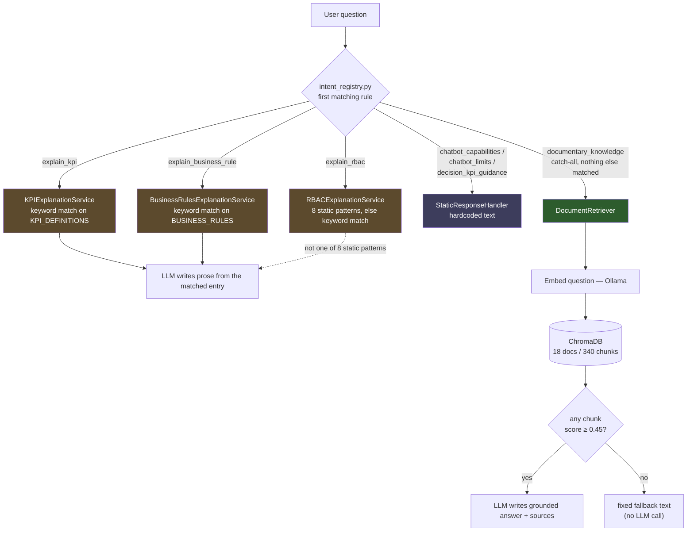

# Chatbot Response Mechanisms — Disambiguating "RAG"

## 1. Purpose

Three unrelated response mechanisms are all informally called "RAG" in product
discussions and in some docs (see §4). This caused real confusion during the
2026-07-28 audit: a fallback triggered by an unreachable Ollama/ChromaDB was
assumed to affect every documentary answer, when in fact most of them never
touch ChromaDB at all.

This document is the single source of truth for which mechanism answers a
given question. It does not replace
[`ai_chatbot_hybrid_rag_architecture.md`](../03_architecture/ai_chatbot_hybrid_rag_architecture.md)
(the full architecture reference) — it is the short disambiguation table that
document was missing.

## 2. The three mechanisms

Only **Mechanism 1** is Retrieval-Augmented Generation in the literal sense
(vector retrieval feeding an LLM prompt). Mechanisms 2 and 3 answer
"documentary" or "conceptual" questions too, which is why they get lumped in
under the same "RAG" label in casual usage — but neither one ever calls
ChromaDB.

| | Mechanism 1 — Real RAG | Mechanism 2 — Templated knowledge base | Mechanism 3 — Static responses |
|---|---|---|---|
| **What runs** | `DocumentRetriever` → ChromaDB semantic search → `RAGPromptBuilder` → LLM → `SourceFormatter` | Keyword match against a hardcoded Python `dict` → LLM turns the match into prose | Hardcoded French/English text, returned as-is |
| **ChromaDB involved?** | Yes | **No** | **No** |
| **LLM involved?** | Yes | Yes (except the "nothing matched" fallback) | **No** |
| **Corpus** | 18 Markdown docs, chunked and embedded ([manifest](rag_document_corpus_manifest.md)) | `KPI_DEFINITIONS` (`ai_service/app/tools/kpi_tool.py`), `BUSINESS_RULES` (`ai_service/app/tools/business_rules_tool.py`), RBAC static texts (`ai_service/app/services/rbac_explanation_service.py`) | Inline strings in `ai_service/app/handlers/static_response_handler.py` |
| **Handler / service** | `RAGResponseHandler` (`ai_service/app/handlers/rag_response_handler.py`) | `KPIExplanationService`, `BusinessRulesExplanationService`, `RBACExplanationService` (`ai_service/app/services/`) | `StaticResponseHandler` (`ai_service/app/handlers/static_response_handler.py`) |
| **Route type** (`app/orchestrator/intent_types.py`) | `RAG` | `TOOL` | `STATIC` |
| **`source` field returned to the client** | `rag_retriever` | `kpi_explanation_tool[+ llm]`, `business_rules_tool[+ llm]`, `rbac_tool[+ llm]` | `orchestrator` |
| **Answers when unreachable / no match** | ChromaDB or Ollama down → `RAG_INFRA_UNAVAILABLE_ANSWER`; no chunk above `rag_min_score` → `RAG_FALLBACK_ANSWER` (no LLM call) | Dict has no keyword match → fixed "not documented" message (no LLM call) | N/A — always answers, no failure mode |
| **Triggering intent(s)** | `documentary_knowledge` — the catch-all for documentation questions not covered by any other rule | `explain_kpi`, `explain_business_rule`, `explain_rbac` | `chatbot_capabilities`, `chatbot_limits`, `decision_kpi_guidance` |

### Mechanism 2, one more layer of nuance

`RBACExplanationService` short-circuits on 8 exact-match question patterns
(e.g. "what roles exist", "can I approve a request") with pure hardcoded
text and **zero** LLM call — same idea as Mechanism 3, but scoped to RBAC and
implemented inside the RBAC service rather than `StaticResponseHandler`. Only
when none of those 8 patterns match does it fall back to the keyword-search +
LLM path described above. `KPIExplanationService` and
`BusinessRulesExplanationService` don't have this static short-circuit — they
go straight to keyword search.

## 3. Which question hits which mechanism

The router (`app/orchestrator/intent_registry.py`) evaluates deterministic
keyword/regex rules in priority order — see
[§7.1 of the architecture doc](../03_architecture/ai_chatbot_hybrid_rag_architecture.md#71-detection-order)
for the full ordered list. What matters here is where each rule points:

`documentary_knowledge` (Mechanism 1) is a **catch-all**: it only fires for
documentation topics that have no dedicated deterministic rule — architecture,
monitoring, chatbot security rules, and any KPI/business-rule/RBAC phrasing
that the keyword rules for Mechanism 2 don't recognise. In practice, most
"conceptual" questions asked in testing are answered by Mechanism 2, not
Mechanism 1 — which is the opposite of what the "RAG" label suggests.

## 4. Why the same corpus feeds two different mechanisms

`chatbot_kpi_knowledge.md`, `chatbot_pricing_workflow_knowledge.md`,
`chatbot_rbac_knowledge.md`, `chatbot_pricing_decision_support.md` and
`chatbot_promotion_knowledge.md` are all listed in the
[RAG document corpus manifest](rag_document_corpus_manifest.md) — meaning
they *are* chunked and embedded into ChromaDB, and available to Mechanism 1.

But their content is **also** manually duplicated as hardcoded Python dicts
consumed by Mechanism 2 (`KPI_DEFINITIONS`, `BUSINESS_RULES`, RBAC texts).
These are two independent code paths kept in sync by hand: updating the
Markdown doc alone does not change what `explain_kpi` / `explain_business_rule`
/ `explain_rbac` answer, because those intents never reach ChromaDB. A KPI
definition change needs both files touched:

| To change... | Update the Markdown doc (Mechanism 1, catch-all only) | Update the Python dict (Mechanism 2, the path actually hit for `explain_*` intents) |
|---|---|---|
| KPI formula/definition | `docs/05_ai/chatbot_kpi_knowledge.md` | `ai_service/app/tools/kpi_tool.py::KPI_DEFINITIONS` |
| Business rule wording | `docs/05_ai/chatbot_pricing_workflow_knowledge.md` | `ai_service/app/tools/business_rules_tool.py::BUSINESS_RULES` |
| RBAC role/permission text | `docs/05_ai/chatbot_rbac_knowledge.md` | `ai_service/app/services/rbac_explanation_service.py` static texts |

Re-indexing (`uv run python scripts/index_rag_documents.py --reset`) only
refreshes what Mechanism 1 can retrieve — it has no effect on Mechanism 2 or 3.

## 5. Related documents

- [AI Chatbot — Hybrid Architecture](../03_architecture/ai_chatbot_hybrid_rag_architecture.md) — full architecture reference
- [RAG Document Corpus Manifest](rag_document_corpus_manifest.md)
- [RAG Vector Indexing](rag_vector_indexing.md)
- [Chatbot Capabilities and Limitations](chatbot_capabilities.md)
